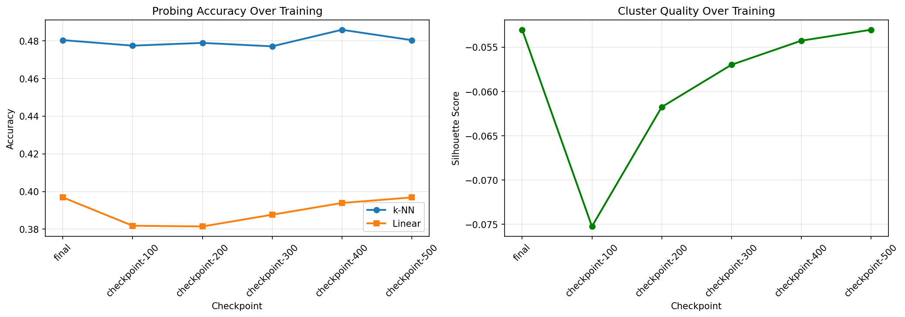
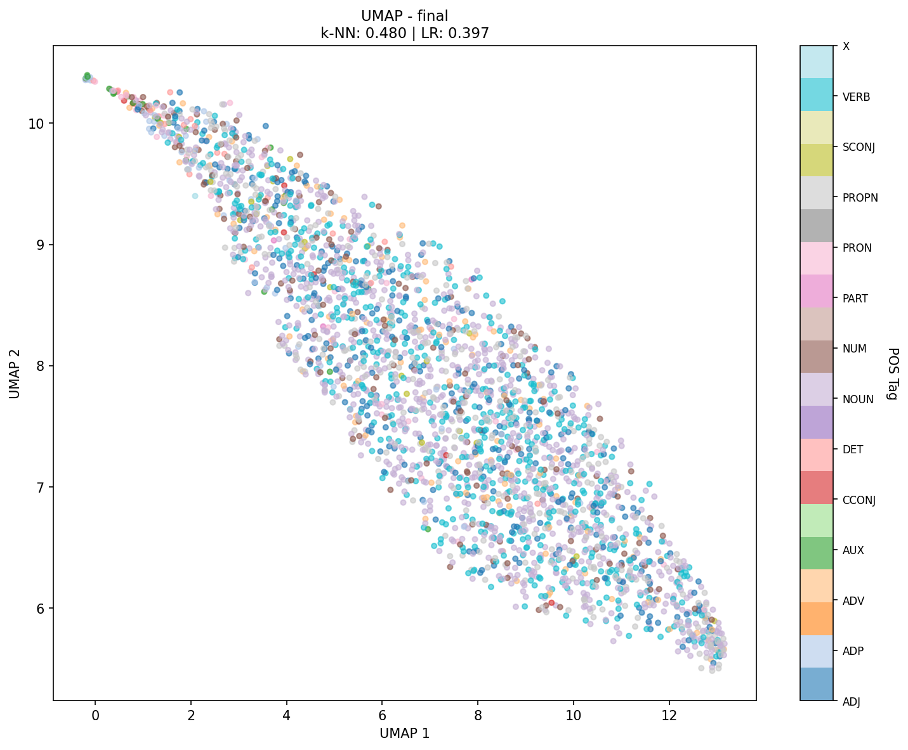
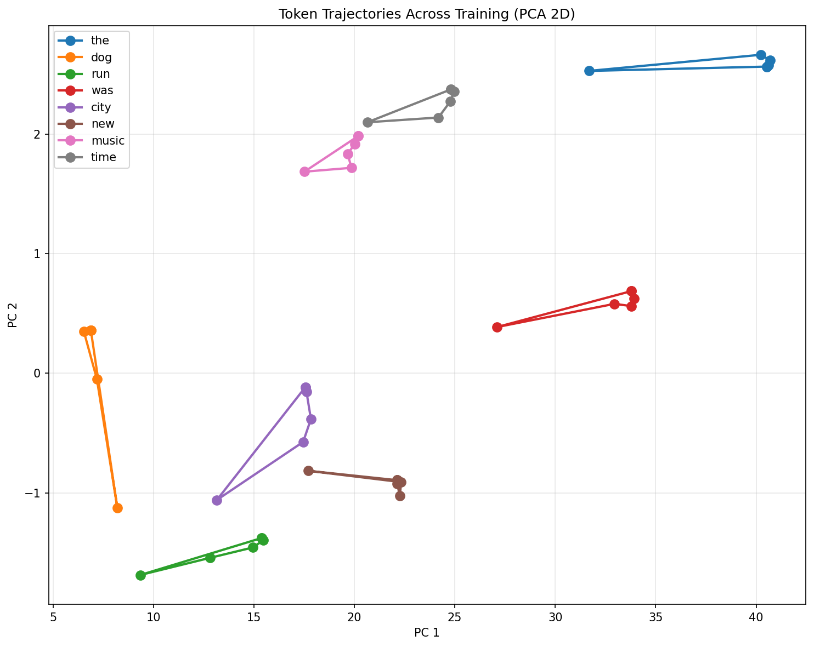

# Linguistic Structure Emergence in Small Language Models

[](https://www.python.org/downloads/)
[](https://opensource.org/licenses/MIT)
[](https://github.com/psf/black)

> *An experimental pipeline for studying when and how linguistic structure emerges during transformer training*

<p align="center">
  
</p>

<p align="center">
  <em>A minimal, reproducible pipeline for studying when linguistic structure emerges in language models</em>
</p>

---

> **Key Finding:** No POS structure emerged in a 1-layer, 64-dim model trained for 500 steps, 
> establishing baseline capacity requirements for linguistic emergence.

---

## Overview

This project investigates a fundamental question in language model interpretability: **At what point during training do neural networks develop internal representations organized by linguistic categories?**

By training small GPT-2 style models from scratch with frequent checkpointing, we track how token embeddings evolve across training steps. Using part-of-speech (POS) tags as ground truth, we measure emergence through multiple independent metrics: probing classifiers, UMAP visualization, silhouette analysis, and cosine similarity patterns.

**Key contribution:** This work establishes **baseline capacity and training requirements** for linguistic structure emergence, demonstrating that organization by grammatical category is not automatic but requires minimum architectural scale and data exposure.

---

## Motivation

Recent work in interpretability (e.g., [Isabel Papadimitriou, Jacob Prince](https://arxiv.org/abs/2510.07613)) shows how vocabulary embeddings organize linguistic struture early in language model training. Howeever, this project provides a **minimal, reproducible framework** for studying the emergence dynamics at a scale accessible to individual researchers (CPU-only, <1 hour runtime).

---

## Key Findings

### Summary
**No linguistic structure emerged** in a 1-layer, 64-dimension GPT-2 model trained for 500 steps on 2,000 WikiText examples.

### Evidence

| Metric | Result | Interpretation |
|--------|--------|----------------|
| **k-NN Probing Accuracy** | 48% | Barely above random (~14% for 14 classes) |
| **Linear Probe Accuracy** | 40% | Not linearly separable |
| **Silhouette Score** | -0.05 | Negative = worse than random clustering |
| **Intra/Inter-class Similarity** | 0.83 vs 0.83 | No separation (gap ≈ 0) |
| **Visual (UMAP)** | Random scatter | No visible POS clustering |

### Scientific Value

These **negative results** are scientifically informative:

1. **Establish lower bounds:** Demonstrate that emergence requires minimum capacity (>1 layer) and training (>500 steps)
2. **Methodological validation:** Five independent metrics all agree—pipeline successfully detects absence of structure
3. **Baseline for comparison:** Provides reference point for "no emergence" state
4. **Research questions:** What is the minimum model size / training duration for emergence? Does it appear gradually or suddenly?

---

## Pipeline Architecture
```
┌─────────────────────────────────────────────────────────────┐
│ 1. BUILD POS MAP (build_token_pos_map_cpu.py)              │
│    WikiText-2 → spaCy POS tagging → token_pos_map.json     │
│    Output: 2,729 tokens with POS labels                    │
└─────────────────────────────────────────────────────────────┘
                           ↓
┌─────────────────────────────────────────────────────────────┐
│ 2. TRAIN MODEL (train_cpu.py)                              │
│    Train tiny GPT-2 with checkpoints every 100 steps       │
│    Output: checkpoint-{100,200,300,400,500}/ + metadata    │
└─────────────────────────────────────────────────────────────┘
                           ↓
┌─────────────────────────────────────────────────────────────┐
│ 3. ANALYZE EMBEDDINGS (analyze_cpu.py)            │
│    Extract embeddings → UMAP, probing, silhouette, etc.    │
│    Output: Visualizations + comprehensive metrics          │
└─────────────────────────────────────────────────────────────┘
```

### Three Core Scripts

1. **`build_token_pos_map_cpu.py`** - Creates token→POS ground truth
   - Uses spaCy for linguistic annotation
   - Maps only single-token words (avoids subword ambiguity)
   - Filters noise (punctuation, rare tokens)

2. **`train_cpu.py`** - Trains models with frequent checkpointing
   - Tiny architecture (1 layer, 64 dim, 2 heads)
   - Saves model every 100 steps
   - Records full hyperparameter metadata

3. **`analyze_cpu.py`** - Multi-metric embedding analysis
   - UMAP/PCA visualization colored by POS
   - k-NN and linear probing classifiers
   - Silhouette scores per POS category
   - Intra/inter-class cosine similarity
   - Token trajectories across training
   - Nearest neighbor analysis

---

## 🚀 Quick Start

### Prerequisites
- Python 3.8+
- ~2GB disk space
- CPU with 2+ cores (no GPU needed!)

### Installation
```bash
# 1. Clone repository
git clone https://github.com/shedrachikenna/lm-research-pilot.git
cd lm-research-pilot

# 2. Create virtual environment
python -m venv venv
venv\Scripts\Activate

# 3. Install dependencies
pip install -r requirements.txt
python -m spacy download en_core_web_sm
```

### Run Complete Pipeline
```bash
# Step 1: Build POS mapping (~2-3 min)
python build_token_pos_map_cpu.py

# Step 2: Train model (~5-10 min)
python train_cpu.py

# Step 3: Analyze embeddings (~5-10 min)
python analyze_cpu.py
```

**Total runtime:** ~10-20 minutes on a typical laptop

---

## 📂 Repository Structure
```
lm-research-pilot/
├── build_token_pos_map_cpu.py    # POS mapping creation
├── train_cpu.py                  # Model training
├── analyze_cpu.py                # Analysis results 
├── requirements.txt              # Python dependencies
├── README.md                     # This file 
│
├── token_pos_map.json           # Generated: token→POS mapping
│
├── pilot_gpt2_cpu/              # Generated: training outputs
│   ├── checkpoint-100/
│   ├── checkpoint-200/
│   ├── ...
│   ├── final/
│   └── training_metadata.json
│
└── analysis_results/   # Generated: analysis outputs
    ├── umap_checkpoint-*.png
    ├── token_trajectories.png
    ├── accuracy_over_time.png
    ├── metrics.json
    ├── nearest_neighbors.json
    ├── intra_inter_cosine.json
    └── silhouette_per_pos.json
```

---

## Results & Visualizations

### UMAP Visualization (Final Model)



*No visible clustering by POS category. Tokens of all grammatical types are randomly mixed in embedding space.*

### Probing Accuracy Over Training


*Probing accuracy remains flat around 40-48% across all training steps, indicating no learning of POS structure.*

### Token Trajectories



*Individual tokens move in embedding space during training but show no systematic organization by category.*

### Detailed Metrics

See [metrics.json](analysis_results/metrics.json) for complete numerical results including:
- Per-checkpoint probing accuracy (train/test splits)
- Silhouette scores (overall + per POS category)
- Explained variance from PCA
- Nearest neighbors for exemplar words
- Intra/inter-class cosine similarity

---

## Detailed Analysis

### 1. Probing Classifiers

**Method:** Train k-NN and logistic regression classifiers to predict POS from embeddings

**Results:**
```
Checkpoint-500:
  k-NN:  48.0% accuracy (random = 7-14%)
  Linear: 39.7% accuracy
```

**Interpretation:** Models perform only slightly better than random, indicating weak linear separability of POS categories.

### 2. Silhouette Analysis

**Method:** Measure cluster quality (how well-separated POS categories are)

**Results:**
```
Overall: -0.053
NOUN:    -0.040
VERB:    -0.018
CCONJ:   -0.302  (worst)
```

**Interpretation:** All categories show negative silhouette scores, meaning tokens are closer to incorrect clusters than their own cluster—worse than random assignment.

### 3. Cosine Similarity Analysis

**Method:** Compare within-category vs. between-category similarity

**Results (Checkpoint-500):**
```
NOUN:  Intra=0.829, Inter=0.835  (no separation)
VERB:  Intra=0.833, Inter=0.835  (no separation)
```

**Interpretation:** Tokens are equally similar to same-POS and different-POS tokens. No categorical structure.

### 4. Nearest Neighbor Analysis

**Method:** Find most similar tokens in embedding space

**Example ("dog" at Checkpoint-500):**
```
Nearest neighbors: saved, aimed, nam, Southern, helicopter
Expected:          cat, pet, animal, puppy
```

**Interpretation:** Content words show random neighbors, not semantic similarity.

---

## Implications for Future Work

### What Would Success Look Like?

A successful model should show:
- **Probing accuracy** >60-70%
- **Silhouette scores** >+0.30
- **Intra/inter gap** >0.30 (high within, low between)
- **Semantic neighbors** (dog → cat, pet, animal)

### Hypotheses to Test

1. **Capacity threshold:** Does emergence appear at 2 layers? 3 layers?
2. **Training dynamics:** Gradual or sudden (phase transition)?
3. **Data requirements:** How many examples needed?
4. **Architecture effects:** Does attention pattern matter?

### Recommended Next Experiments
```bash
# Larger model
python train_cpu.py --n-layer 2 --n-embd 256 --max-steps 3000

# More data
python build_token_pos_map_cpu.py --num-words 200000
python train_cpu.py --num-samples 20000

# Different architectures
python train_cpu.py --n-head 4 --block-size 64
```

---

## Experimental Design

### Model Architecture
```python
GPT2Config(
    vocab_size=50257,      # Standard GPT-2 tokenizer
    n_positions=32,        # Context length
    n_embd=64,             # Embedding dimension
    n_layer=1,             # Transformer layers
    n_head=2,              # Attention heads
)
```

### Training Configuration
```python
- Dataset: WikiText-2 (2,000 examples)
- Optimizer: AdamW
- Learning rate: 5e-4
- Batch size: 16 (effective)
- Steps: 500
- Checkpoints: Every 100 steps
```

### Evaluation Methodology

**Multiple independent metrics** ensure robust conclusions:

1. **Probing:** Tests linear separability
2. **Silhouette:** Measures cluster quality
3. **Cosine similarity:** Quantifies separation
4. **UMAP:** Visual confirmation
5. **Nearest neighbors:** Semantic structure check

All five metrics agree on absence of structure → **high confidence** in findings.

---

## Related Work

This project is inspired by:

- **Isabel Papadimitriou, Jacob Prince (2025)** - ["Vocabulary embeddings organize linguistic structure early in language model training"](https://arxiv.org/abs/2510.07613)

### Differences from Prior Work

| Aspect | This Project | Typical Research |
|--------|--------------|------------------|
| **Scale** | 1 layer, 3.5M params | 12-96 layers, 100M-175B params |
| **Training** | From scratch | Pretrained models |
| **Compute** | CPU, <1 hour | GPU cluster, days/weeks |
| **Focus** | Training dynamics | Final model analysis |
| **Contribution** | Lower bounds on emergence | Capabilities of large models |

---

## Reproducibility

### Deterministic Training
```python
set_seed(42)
torch.set_num_threads(2)
```

### Saved Artifacts
- `training_metadata.json` - Complete hyperparameters
- `token_pos_map.json` - Exact POS assignments used
- `metrics.json` - All numerical results

### Core Version Information
```
Python: 3.8+
torch: 2.9.1
transformers: 4.57.1
spacy: 3.8.9
scikit-learn: 1.7.2
umap-learn: 0.5.9.post2
datasets: 4.4.1
```

---

## Contributing

Contributions welcome! Areas for improvement:

- [ ] Add support for other datasets (BookCorpus, C4)
- [ ] Implement other linguistic annotations (syntax, semantics)
- [ ] Add CKA / representational similarity analysis
- [ ] Compare different tokenizers (BPE, WordPiece, SentencePiece)
- [ ] Add attention pattern analysis
- [ ] Implement contrastive learning baselines

---

## License

MIT License - See [LICENSE](LICENSE) for details

---

## Contact

**Shedrach Nwali**
- Email: Shedrach686@gmail.com
- GitHub: [@shedrachikenna](https://github.com/shedrachIkenna)

---

## Acknowledgments

- Inspired by Isabel Papadimitriou's work on linguistic structure in LMs
- Built using HuggingFace Transformers and spaCy
- UMAP implementation by Leland McInnes et al.

---

## Citation

If you use this code or findings in your research, please cite:
```bibtex
@software{nwali2024emergence,
  author = {Nwali, Shedrach Ikenna},
  title = {Linguistic Structure Emergence in Small Language Models: 
           Establishing Capacity Lower Bounds},
  year = {2025},
  url = {https://github.com/shedrachIkenna/lm-research-pilot}
}
```

---

## Roadmap

### Completed 
- [x] Basic pipeline implementation
- [x] Multi-metric evaluation framework
- [x] Comprehensive documentation
- [x] Reproducible experimental setup

### Planned 
- [ ] Scale experiments (2-4 layers, varying dimensions)
- [ ] Systematic capacity/data ablations
- [ ] Additional linguistic features (syntax, semantics)
- [ ] Interactive visualizations (Streamlit/Gradio)
- [ ] Technical report / blog post

---

**Last Updated:** November 2024